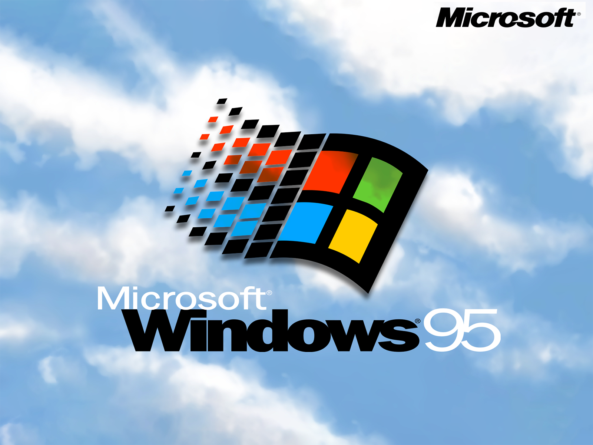

# Portfolio Win95 Website Project Completed ✔

## About This Project
This is my experiment of webcomponents. I came up with this awesome idea and created a project based on various sources to develop fun and creative web applications. Hope you like it.

## Explore more?
View online demo [here](https://datit-026.github.io/Win95WebProject/)

## Contact us
- Email: tiendatha2006@gmail.com

Please feel free to contact me through these channels.

### License
Many thanks to [Victor Ribeiro](https://github.com/victorqribeiro/fos).

This project is licensed under the [MIT License](LICENSE).
