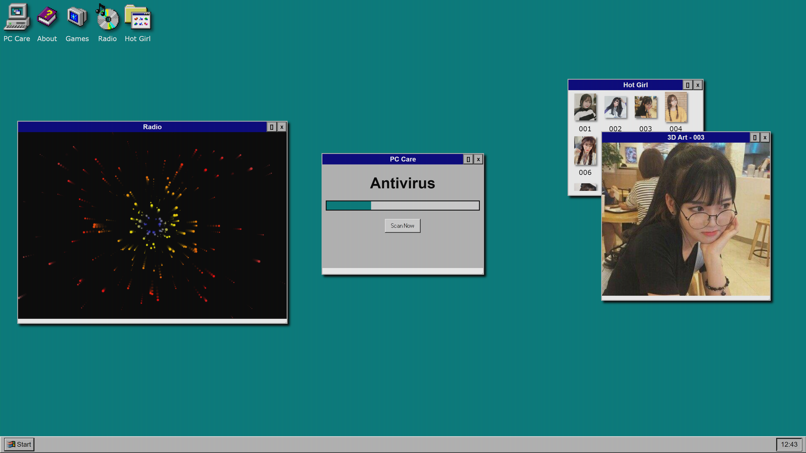

# Portfolio Windows 95 Website Project Completed ✔

## 🎃 Halloween Update is Here! 🎃
Get ready for some spooktacular fun! The latest Halloween Update has arrived, bringing a host of thrilling new features for you:

- Ordinary pictures of the owner have been transformed into eerie images that will haunt you every night!
- Ghostly Sounds: Enjoy creepy sound effects that will send shivers down your spine on the Radio.
- Limited-Time Decorations: Experience festive animations and decorations that celebrate the season.

Don't miss out on this limited-time update! Make sure to check it out and enjoy a particularly good time!

## About This Project
This is my experiment of webcomponents. I came up with this awesome idea and created a project based on various sources to develop fun and creative web applications. Hope you like it.

## Explore more?
View online demo [here](https://datit-026.github.io/Win95WebProject/).

## Contact us
- Email: tiendatha2006@gmail.com
- Social Media: [Facebook](https://www.facebook.com/datit.dev/)

Please feel free to contact me through these channels.

### License
Many thanks to [Victor Ribeiro](https://github.com/victorqribeiro/fos).

This project is licensed under the [MIT License](LICENSE).
